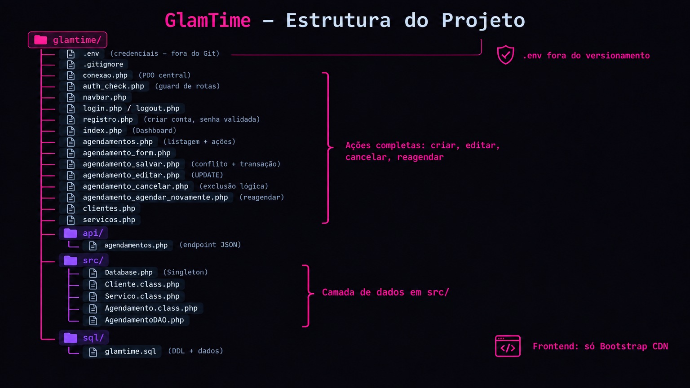

# GlamTime — Sistema de Agendamento para Salão de Beleza



Exercício prático de **Web Back-End**: CRUD completo com **PHP 8 + PDO + MySQL + Bootstrap 5.3**, com foco em segurança, regras de negócio reais (conflito de horários) e arquitetura progressiva (DAO, RBAC, transações).

## 🎯 Objetivo pedagógico

Desenvolver as competências de conexão segura a banco de dados, sessões, CRUD parametrizado e camadas de aplicação — preparando o aluno para o padrão usado por frameworks modernos (Laravel/Symfony).

## 🗂️ Estrutura do projeto

```
glamtime/
├── .env                      # Credenciais (fora do Git!)
├── .gitignore
├── conexao.php               # Conexão PDO central
├── auth_check.php            # Guard de rotas protegidas
├── navbar.php
├── login.php / logout.php    # Autenticação
├── registro.php              # Criação de conta (senha validada, role fixo)
├── index.php                 # Dashboard
├── agendamentos.php          # Listagem + filtro + ações
├── agendamento_form.php
├── agendamento_salvar.php    # Conflito de horário + transação
├── agendamento_editar.php    # UPDATE com verificação de conflito
├── agendamento_cancelar.php  # Exclusão lógica
├── agendamento_agendar_novamente.php  # Reagendar em transação
├── clientes.php / servicos.php
├── api/agendamentos.php      # Endpoint JSON
├── src/
│   ├── Database.php          # Singleton PDO
│   ├── Agendamento.class.php
│   ├── Cliente.class.php
│   ├── Servico.class.php
│   └── AgendamentoDAO.php    # Camada de acesso a dados
└── sql/glamtime.sql          # DDL + dados iniciais
```

## ⚙️ Setup

1. Clone o repositório:
```
git clone https://github.com/SU-USUARIO/glamtime.git
```
2. Importe o banco (estrutura + dados de exemplo):
```
mysql -u root < sql/glamtime.sql
```
3. Gere os hashes das senhas dos usuários e cole no lugar dos marcadores `[GERAR_HASH_ADMIN]` e `[GERAR_HASH_RECEP]` em `sql/glamtime.sql` (antes ou depois de importar):
```
php -r "echo password_hash('admin', PASSWORD_DEFAULT), PHP_EOL;"
php -r "echo password_hash('recep123', PASSWORD_DEFAULT), PHP_EOL;"
```
4. Crie o `.env` na raiz:
```
DB_HOST=localhost
DB_PORT=3306
DB_NAME=glamtime
DB_USER=root
DB_PASS=
```
5. Suba na raiz do servidor (XAMPP): `localhost/glamtime`
6. Faça login:
   - **admin**: `admin@glamtime.com` / `admin`
   - **recepcionista**: `recepcao@glamtime.com` / `recep123`
   - Novas contas podem ser criadas em `registro.php` (sempre nascem como recepcionista; promoção a admin é exclusiva de SQL ou de um admin).

## 🔐 Requisitos técnicos (avaliados)

- Prepared statements em 100% das queries (`EMULATE_PREPARES => false`)
- ⚠️ Cada placeholder aparece exatamente UMA vez na SQL — reusar o mesmo nome dispara `SQLSTATE[HY093]`; calcule valores derivados (ex.: fim do intervalo) no PHP
- `password_hash`/`password_verify` + `session_regenerate_id(true)`
- CSRF token em todo POST (incluir, editar, cancelar, reagendar)
- Saída sempre com `htmlspecialchars()`
- RBAC: somente `admin` gerencia serviços
- Bloqueio de conflito de horário antes de INSERT e UPDATE
- `DECIMAL(10,2)` para preços · charset `utf8mb4`

## 📦 Blocos de entrega (commit por bloco)

| Bloco | Escopo | Peso |
|---|---|---|
| 1 | Ambiente, banco, fluxo e sessões | 15% |
| 2 | OO + API JSON | 15% |
| 3 | CRUD completo + conflito de horário | 25% |
| 4 | Segurança (caça-bugs) | 30% |
| 5 | DAO, Dashboard, transação | 15% |

## 📄 Licença

Material didático — IFSC, uso livre para fins educacionais.
